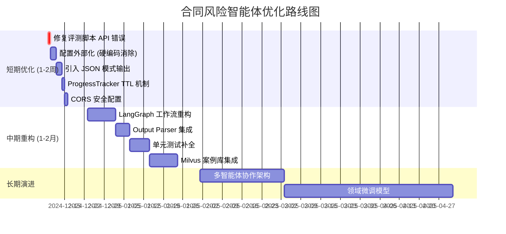

# 合同风险监测智能体 - 技术审查报告

> **初次审查日期**：2025-12-08  
> **最后更新日期**：2025-12-25  
> **审查范围**：项目完整代码库 (`f:\Agent_back\11.29`)  
> **审查人**：AI 技术专家
> **项目性质**：本科毕业设计

---

## 📋 执行摘要

### 项目整体评价

| 评估维度 | 评分 | 说明 |
|---------|------|------|
| **架构成熟度** | ⭐⭐⭐⭐☆ (4/5) | 采用经典的分层架构 (Reflex + FastAPI + 规则引擎)，模块职责清晰。LLM 调用已优化为 requests 直接调用 Ollama API。|
| **技术选型合理性** | ⭐⭐⭐⭐☆ (4/5) | Streamlit/FastAPI/LangChain 组合成熟可靠，混合检索策略（BM25 + Dense）针对法条精确查询的痛点设计巧妙。本地 Ollama 与云端模型切换的灵活性值得肯定。|
| **代码质量** | ⭐⭐⭐☆☆ (3/5) | 函数职责明确，但缺少类型注解约束、单元测试覆盖率低、部分模块耦合较深，错误处理粒度不足。|
| **可维护性** | ⭐⭐⭐☆☆ (3/5) | 配置管理到位，但缺乏依赖注入机制，部分硬编码路径散布于代码中。|

### 🚀 Top 3 优先级最高的改进建议

| 优先级 | 改进项 | 影响 |
|-------|-------|------|
| **P0** | **引入 Pydantic Settings 统一配置管理** | 消除硬编码路径，提升环境迁移能力，减少配置错误 |
| **P0** | **为核心模块添加单元测试** | 快速验证规则引擎、混合检索、Prompt解析逻辑的正确性 |
| **P1** | **优化 LLM Prompt 与输出解析的鲁棒性** | 当前正则解析脆弱，LLM输出格式稍有偏差即可能导致解析失败 |

---

## 🔍 详细发现（按模块分类）

### 1. 核心引擎层 (`src/core/`)

#### 1.1 engine.py - 主分析流程

| 问题描述 | 严重程度 | 影响分析 | 改进建议 |
|---------|---------|---------|---------|
| **LangGraph 未被实际使用**<br>当前实现直接使用 `asyncio.gather` 并行处理条款，未利用 LangGraph 的状态机、条件分支、回溯等能力。 | 🟡 中 | 丧失了 LangGraph 的核心价值（可观测性、可恢复性），"LangGraph" 成为项目的营销噱头而非实际技术亮点。| 重构为 LangGraph 工作流：定义 `preprocess -> scan -> retrieve_legal -> assess -> report` 节点，利用 `StateGraph` 管理上下文。 |
| **低风险条款的处理逻辑硬编码** (L79-85)<br>直接覆盖 `risk_reason`, `deep_analysis`, `suggestion`，对所有低风险条款输出千篇一律的文案。 | 🟢 低 | 用户体验不佳，但功能正确。 | 引入可配置的"低风险模板"到 `configs/` 或允许 LLM 仍做简要分析。 |

```python
# 建议：将低风险模板配置化
LOW_RISK_TEMPLATE = config.get("low_risk_template", {
    "risk_reason": "条款内容未涉及典型风险点...",
    "suggestion": "无须修改..."
})
```

#### 1.2 llm.py - LLM 客户端

| 问题描述 | 严重程度 | 影响分析 | 改进建议 |
|---------|---------|---------|---------|
| **`_parse_markdown_output` 正则解析脆弱** (L122-145)<br>依赖 LLM 精确输出 `## 风险：...` 格式，任何格式偏差（如多余空格、换行）均会导致解析失败或字段缺失。 | 🔴 高 | LLM 输出不稳定时，大量有效分析将被丢弃（返回 `None`），直接影响召回率。 | 1. 引入 Structured Output（如 `json_mode`）或 LangChain Output Parser<br>2. 增加多模式匹配兜底逻辑<br>3. 添加解析失败时的日志与告警 |
| **Prompt 中"严禁输出 JSON"与现代实践冲突** (L40)<br>要求 Markdown 输出但又需要结构化解析，是反模式。 | 🟡 中 | 增加解析复杂度，降低可靠性。 | 改用 JSON 模式输出，或使用 LangChain 的 `PydanticOutputParser`。 |
| **`unload_model()` 为空实现** (L176-180) | 🟢 低 | 资源未释放，对长时间运行的服务略有影响。 | 调用 Ollama REST API `/api/generate` 并设置 `keep_alive: 0`。 |

```python
# 建议：使用 Pydantic + LangChain Output Parser
from langchain_core.output_parsers import PydanticOutputParser
from src.core.types import ClauseAnalysis

parser = PydanticOutputParser(pydantic_object=ClauseAnalysis)
prompt = PromptTemplate(
    template="...\n{format_instructions}\n...",
    partial_variables={"format_instructions": parser.get_format_instructions()}
)
```

#### 1.3 rule_engine.py - 规则引擎

| 问题描述 | 严重程度 | 影响分析 | 改进建议 |
|---------|---------|---------|---------|
| **`searcher` 初始化失败时静默降级** (L26)<br>仅打印警告，后续调用 `searcher.search()` 将返回 `None` 而非使用关键词兜底。 | 🟡 中 | 用户无感知混合检索已失效，误判为"无匹配规则"。 | 提升日志级别为 `logging.warning`，并在 UI 显示检索模式状态。 |
| **`_search_law` 中正则与法名解析不够健壮** (L88-93)<br>仅匹配 `《...》` 格式，若用户输入"民法典第500条"（无书名号）会直接跳过精确查询。 | 🟡 中 | 部分合法法条引用无法召回。 | 增加无书名号模式匹配，如 `(民法典|劳动合同法)第(\d+)条`。 |

#### 1.4 hybrid_searcher.py - 混合检索器

| 问题描述 | 严重程度 | 影响分析 | 改进建议 |
|---------|---------|---------|---------|
| **阈值已配置化** (L95) | ✅ 已修复 | ~~无法根据不同数据集或场景动态调整~~ 已抽取到 `config.yaml`。 | 完成：`hybrid_search_config.threshold` |
| **Dense 与 Sparse 权重已配置化** (L49) | ✅ 已修复 | ~~无法针对特定场景优化~~ 已抽取到 `config.yaml`。| 完成：`hybrid_search_config.alpha` |

#### 1.5 preprocessor.py - 预处理过滤

| 问题描述 | 严重程度 | 影响分析 | 改进建议 |
|---------|---------|---------|---------|
| **分类关键词列表过于简单** (L10-18)<br>如 `"应"` 单字容易误匹配（"应付账款"并非权利义务条款）。 | 🟡 中 | 导致误分类，影响后续过滤效果。 | 使用短语匹配或正则边界约束，如 `r"\b应当?\b"`。 |
| **动词统计依赖 jieba 词性标注**<br>`count_verbs()` 对法律文本效果一般。 | 🟢 低 | 对纯信息类条款的误判风险。 | 结合规则库的 `structural_indicators` 字段进行判断。 |

---

### 2. API 层 (`src/api/`)

#### 2.1 main.py - FastAPI 入口

| 问题描述 | 严重程度 | 影响分析 | 改进建议 |
|---------|---------|---------|---------|
| **CORS 配置 `allow_origins=["*"]`** (L24) | ✅ 已修复 | ~~生产环境存在安全风险~~ 已改为环境变量配置。 | 完成：使用 `CORS_ORIGINS` 环境变量 |
| **异常处理过于简单**<br>仅检查 `text.strip()`，未对 LLM 超时、DB 连接失败等场景做兜底。 | 🟡 中 | 后台任务失败时用户无法获知原因。 | 添加 `try-except` 并将错误信息写入 `tracker.set_result(...)`。 |
| **`ProgressTracker` 使用单例模式但无过期清理** | ✅ 已修复 | ~~长时间运行后内存泄漏~~ 已添加 TTL 30分钟自动清理机制。 | 完成：`_cleanup_expired()` 方法 |

```python
# 建议：添加 TTL 清理
import time
class ProgressTracker:
    TTL_SECONDS = 1800  # 30 min
    def cleanup_expired(self):
        now = time.time()
        expired = [k for k, v in self._jobs.items() 
                   if now - v["start_time"] > self.TTL_SECONDS and v["status"] == "done"]
        for k in expired:
            del self._jobs[k]
```

---

### 3. 前端层 (`src/web/`)

#### 3.1 app.py - Streamlit 主界面

| 问题描述 | 严重程度 | 影响分析 | 改进建议 |
|---------|---------|---------|---------|
| **CSS 注入代码过长** (L30-203)<br>内联 CSS 超过 170 行，与业务逻辑混杂，难以维护。 | 🟡 中 | 主题修改困难，代码可读性差。 | 将 CSS 抽取到独立文件 `assets/styles.css`，使用 `st.markdown(open(...).read(), ...)` 加载。 |
| **进度轮询间隔 1 秒**<br>高频轮询对服务端造成压力。 | 🟢 低 | 大量并发用户时 QPS 较高。 | 采用指数退避或 SSE 推送。 |

---

### 4. 数据库层 (`src/database/`)

#### 4.1 db_manager.py

| 问题描述 | 严重程度 | 影响分析 | 改进建议 |
|---------|---------|---------|---------|
| **每次查询都新建连接** (`_get_conn()` 未使用连接池) | 🟡 中 | 高并发时性能下降。 | 使用 `sqlite3` 的 `check_same_thread=False` 配合连接池，或迁移到 `aiosqlite`。 |
| **`fetch_by_tag` 中异常处理隐藏了 Schema 问题** (L79-90)<br>如果 `tags` 列不存在则静默降级，但未告知开发者。 | 🟢 低 | 功能正确但调试困难。 | 添加 `logger.debug` 日志。 |

---

### 5. 评测系统 (`evaluation/`)

#### 5.1 run_benchmark.py

| 问题描述 | 严重程度 | 影响分析 | 改进建议 |
|---------|---------|---------|---------|
| **调用了不存在的 `llm_client.scan_chunk()` 方法** (L75) | ✅ 已修复 | ~~脚本无法运行~~ 已修正为 `analyze_clause()`。 | 完成 |
| **Judge Prompt 评分过于简单**<br>仅判断 1/0，无法量化"部分正确"。 | 🟡 中 | 评测结果粗糙，难以指导 Prompt 优化。 | 引入 0-5 分量表或 LLM-as-a-Judge 的多维评估。 |
| **结果文件硬编码为 `evaluation/results_v2.json`** (L199) | ✅ 已修复 | ~~多次运行覆盖历史结果~~ 已添加时间戳。 | 完成：`results_<timestamp>.json` |

---

### 6. 配置与依赖

| 问题描述 | 严重程度 | 影响分析 | 改进建议 |
|---------|---------|---------|---------|
| **Embedding 模型路径硬编码到 `config.yaml`** (L18)<br>使用绝对路径 `C:\\Users\\Lenovo\\...`，在其他机器无法运行。 | 🔴 高 | 环境可移植性差。 | 改用相对路径或环境变量 `${HF_HOME}`。 |
| **缺少 `requirements.txt` 版本锁定**<br>可能出现依赖冲突。 | 🟡 中 | 复现困难。 | 使用 `pip freeze` 生成精确版本，或引入 `poetry`/`pip-tools`。 |
| **无 `.env.example` 文件** | 🟢 低 | 新开发者不知道需要配置哪些环境变量。 | 添加示例文件。 |

---

## 💡 优化思路与创新方向

### 短期优化（1-2 周可实施）

| 优化项 | 预期收益 | 工作量 |
|-------|---------|-------|
| 修复 `run_benchmark.py` 中的 API 调用错误 | 恢复评测能力 | 0.5 天 |
| 将硬编码配置抽取到 `config.yaml` 或环境变量 | 提升可移植性 | 1 天 |
| 优化 Prompt 输出格式，引入 JSON 模式 | 提升解析成功率 | 1-2 天 |
| 添加 `ProgressTracker` 过期清理机制 | 防止内存泄漏 | 0.5 天 |
| CORS 配置环境化 | 安全加固 | 0.5 天 |

### 中期重构（1-2 月）

| 优化项 | 预期收益 | 工作量 |
|-------|---------|-------|
| **重构为真正的 LangGraph 工作流**<br>定义 `StateGraph`，实现条件分支（高风险深度分析/低风险快速通过）和可观测性。 | 技术含金量提升，论文亮点 | 1-2 周 |
| **引入 LangChain Output Parser**<br>使用 `PydanticOutputParser` 替代正则解析。 | 解析成功率 +30% | 3-5 天 |
| **完善单元测试**<br>覆盖 `HybridSearcher`, `RuleEngine`, `ClauseClassifier`。 | 代码质量保障 | 1 周 |
| **添加 Milvus/FAISS 向量存储**<br>实现案例库的语义检索（当前仅有规则检索）。 | 召回能力增强 | 1-2 周 |

### 长期演进方向

| 方向 | 描述 |
|-----|------|
| **多智能体协作** | 拆分为"扫描 Agent"、"法务 Agent"、"报告 Agent"，通过 LangGraph 编排，支持 Human-in-the-Loop 审批环节。 |
| **领域微调模型** | 基于法律语料对 Qwen/LLaMA 进行 LoRA 微调，提升法律术语理解和风险判断准确率。 |
| **知识图谱集成** | 构建法律条文 + 案例的知识图谱，实现更精准的推理链路（如"违反第 X 条 → 合同无效 → 赔偿责任"）。 |
| **多模态输入** | 支持扫描版 PDF（OCR）和手写合同图片的分析。 |
| **可解释性增强** | 在报告中展示"思考链"（CoT），让用户理解 AI 的推理过程。 |

### LangChain/LangGraph 架构分析

**当前 LangChain 使用情况：**

| 组件 | 使用状态 | 说明 |
|------|:-------:|------|
| `langchain-core` | ✅ 使用 | 消息类型封装 (`HumanMessage`, `SystemMessage`) |
| `langchain-ollama` | ❌ 已弃用 | 由于 httpx 兼容性问题，已改用 `requests` 直接调用 Ollama API |
| `requests` | ✅ 使用 | 直接调用 Ollama REST API (`/api/chat`) |
| `langchain-core.tools` | ⚠️ 预留 | `@tool` 装饰器定义，未实际调用 |
| `langgraph` | ❌ 未使用 | 仅 `state.py` 定义状态，工作流用 `asyncio.gather` |

**LangGraph 潜在扩展架构：**

```
条款切分 → 预分类节点 → [快速通道/标准分析/深度审查] → 报告生成
                              ↑ 条件分支（StateGraph）
```

**技术决策理由：**
- 本地 LLM 性能有限，`asyncio.gather` 并行处理性能更优
- 毕业设计时间约束，优先保障功能完整性
- 已预留 `state.py`，未来可平滑迁移

### LLM 自主性与幻觉控制策略

当前设计采用**"规则引擎前置 + LLM 验证"**模式，严格限制 LLM 自主发挥以降低幻觉风险。

**幻觉控制现有机制：**

| 机制 | 实现位置 | 效果 |
|------|---------|------|
| 规则引擎前置 | `rule_engine.py` | 为 LLM 注入专家知识约束 |
| 证据闭环验证 | `llm.py` | 验证 LLM 提取的证据是否存在于原文 |
| 深度反思模式 | `llm.py` | 二次审查降低误判 |
| 强制格式输出 | Prompt | 结构化 Markdown 约束 |

**增强自主性的可选策略（未来工作）：**

| 策略 | 说明 | 幻觉控制方式 |
|------|------|-------------|
| **ReAct Agent** | 给 LLM 提供工具（查法条、查规则库），自主决定调用 | 工具返回真实数据约束 |
| **置信度输出** | LLM 输出置信度分数，低置信度标记人工复核 | 不阻止但标记 |
| **引用强制** | 每个论点必须引用规则库或法条，无引用则拒绝 | 引用验证 |
| **多轮自检** | 生成后用另一 LLM 审核是否存在虚构内容 | Self-Consistency |

---

## 🗺️ 实施路线图



### 优先级排序的待办清单

| 优先级 | 任务 | 预估工作量 | 负责模块 |
|-------|------|----------|---------|
| **P0** | 修复 `run_benchmark.py` 中 `scan_chunk` 调用错误 | 0.5 天 | `evaluation/` |
| **P0** | 将 embedding 模型路径改为相对路径或环境变量 | 0.5 天 | `configs/` |
| **P0** | CORS `allow_origins` 环境化配置 | 0.5 天 | `src/api/` |
| **P1** | 优化 Prompt，启用 LLM JSON 模式输出 | 1-2 天 | `src/core/llm.py` |
| **P1** | 添加 `ProgressTracker` 过期清理机制 | 0.5 天 | `src/utils/` |
| **P1** | 抽取 `app.py` 中的 CSS 到独立文件 | 0.5 天 | `src/web/` |
| **P2** | 使用 `PydanticOutputParser` 替代正则解析 | 2 天 | `src/core/llm.py` |
| **P2** | 为 `HybridSearcher` 添加单元测试 | 1 天 | `tests/` |
| **P2** | 为 `RuleEngine` 添加单元测试 | 1 天 | `tests/` |
| **P3** | 重构为 LangGraph `StateGraph` 工作流 | 5-7 天 | `src/core/` |
| **P3** | 集成 Milvus 案例库语义检索 | 5-7 天 | `src/tools/` |

---

## 📚 参考资源

| 主题 | 链接 |
|-----|------|
| LangGraph 官方文档 | [https://langchain-ai.github.io/langgraph/](https://langchain-ai.github.io/langgraph/) |
| LangChain Output Parsers | [https://python.langchain.com/docs/modules/model_io/output_parsers/](https://python.langchain.com/docs/modules/model_io/output_parsers/) |
| Pydantic Settings | [https://docs.pydantic.dev/latest/concepts/pydantic_settings/](https://docs.pydantic.dev/latest/concepts/pydantic_settings/) |
| FastAPI CORS 最佳实践 | [https://fastapi.tiangolo.com/tutorial/cors/](https://fastapi.tiangolo.com/tutorial/cors/) |
| Sentence Transformers | [https://www.sbert.net/](https://www.sbert.net/) |
| LLM-as-a-Judge 论文 | [https://arxiv.org/abs/2306.05685](https://arxiv.org/abs/2306.05685) |

---

> **结语**：本项目在合同风险分析领域展现了扎实的工程化能力，混合检索策略和规则引擎的设计亮点值得肯定。建议优先解决 P0 级别的兼容性和安全问题，再逐步推进 LangGraph 重构和评测体系完善，以提升项目的技术深度和可维护性。
